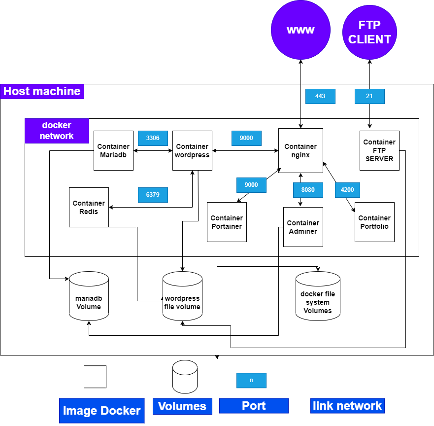

# inception
This project aims to broaden your knowledge of system administration by using Docker. It involves setting up a small infrastructure composed of different services using Docker and Docker Compose. The project must be done on a Virtual Machine, and each service should run in a dedicated container.


*Figure 1: Diagram of the system architecture*
## Prerequisites
Before starting the project, make sure you have the following installed on your machine:

- Docker
- Docker Compose
## Docker Compose Configuration
Below is the Docker Compose configuration used to define the services and volumes for the application:
### Volumes:
The volumes section is used to define persistent storage for containers. It allows you to map directories or files from the host machine to the containers, ensuring that the data is preserved even if the container is stopped or removed.

In the provided Docker Compose configuration, there are three defined volumes:
```yml
volumes:
  data:
    driver_opts:
      type: "bind"
      o: "bind"
      device: "/home/akhouya/data/mysql"
  wordpress:
    driver_opts:
      type: "none"
      o: "bind"
      device: "/home/akhouya/data/wordpress"
  portainer:
    driver_opts:
      type: "none"
      o: "bind"
      device: "/home/akhouya/data/portainer"
```
data: This volume is used to store the data for the MariaDB service. It is mounted to the /var/lib/mysql/ directory inside the container, which is the default data directory for MariaDB. The volume is defined as a bind mount, where the host's /home/akhouya/data/mysql directory is bound to the container's /var/lib/mysql/ directory.

wordpress: This volume is used to store the data for the WordPress service. It is mounted to the /wordpress directory inside the container. Similar to the data volume, it is also defined as a bind mount, with the host's /home/akhouya/data/wordpress directory bound to the container's /wordpress directory.

portainer: This volume is used by the Portainer service to persist its data. It is defined as a bind mount, with the host's /home/akhouya/data/portainer directory bound to the container's default data directory.

### Networks:
The networks section is used to define custom networks that containers can be connected to. It allows containers to communicate with each other using their service names as hostnames.

In the provided Docker Compose configuration, there is one defined network:
```yml
networks:
  inception:
      driver: bridge
```
inception: This network is a custom bridge network created specifically for the project. All services defined in the configuration are connected to this network by specifying networks: - inception for each service.
By connecting the services to the same network, they can communicate with each other using their service names as hostnames. For example, the WordPress service can communicate with the MariaDB service using the hostname mariadb.

Defining custom networks helps in isolating the containers and provides a way for them to interact securely within the defined network scope.

## Containers
#### Base Image: Debian Buster

All containers in this project are based on the Debian Buster image. Debian Buster is a stable and widely used Linux distribution known for its reliability and security. By using Debian Buster as the base image, we ensure a consistent and stable environment for running our containers.
### MariaDB Container
The MariaDB container is responsible for running the MariaDB server, which serves as the database for the WordPress application.
#### Dockerfile

The Dockerfile sets up the MariaDB container by installing the mariadb-server package and allowing connections from outside the container. It copies the create.sh script into the container and sets the necessary permissions. It also sets the environment variables required for the script.

The create.sh script is run during the container build process. It creates the database and user, grants privileges, and performs other necessary configurations.

Please note that the script assumes the values of the environment variables (MYSQL_USER, MYSQL_PASSWORD, MYSQL_DB, MYSQL_HOST, DB_ROOT_PASSWORD) will be provided during the container build or deployment process.

Ensure that you have the create.sh script in the tools/ directory within your project structure.

Feel free to modify the script or Dockerfile according to your specific needs and configurations.

Remember to provide the appropriate values for the environment variables when building or running the container.

### wordpress Container
The WordPress container runs the WordPress application using PHP-FPM and connects it to the MariaDB database.
#### Dockerfile
The Dockerfile for the WordPress container installs PHP, PHP-FPM, PHP MySQL extension, MariaDB client, and other necessary dependencies. It also downloads and configures the WP-CLI tool for managing the WordPress installation.

#### WordPress Connection to MariaDB
The WordPress container needs to connect to the MariaDB database for storing and retrieving data. This connection is established during the container's startup using a script (create.sh).

The create.sh script sets up the necessary configurations for WordPress, including the database host, database name, database user, and database password. It also installs the Redis Cache plugin and enables Redis caching for WordPress.

Make sure to replace the placeholders ${MYSQL_HOST}, ${MYSQL_DB}, ${MYSQL_USER}, ${MYSQL_PASSWORD}, ${WP_FS_METHOD}, ${WP_REDIS_HOST}, ${WP_REDIS_PORT}, ${URL_DNS}, ${WP_TITLE}, ${WP_ADMIN}, ${WP_ADMIN_PSW}, ${WP_ADMIN_EMAIL}, ${WP_USER}, and ${WP_EMAIL} with the appropriate values for your environment.

The create.sh script performs the necessary configurations and installations for WordPress and starts the PHP-FPM process to serve the WordPress application.

That's it for the WordPress container. Continue reading the README for information on other containers and services.
### Nginx Container
The Nginx container serves as a reverse proxy and handles incoming web requests for various services in our project. It also provides SSL encryption for secure communication.
####  Dockerfile
The Dockerfile for the Nginx container installs Nginx and OpenSSL, copies the SSL certificate and key files, and updates the Nginx configuration.

#### Nginx Configuration
The Nginx configuration file (nginx.conf) is responsible for setting up the reverse proxy, SSL encryption, and handling various locations. It also includes proxy parameters for seamless communication with the backend services.
```conf
http {
    server {
        listen 443 ssl;
        ssl_protocols TLSv1.3 TLSv1.2;
        ssl_certificate /etc/ssl/certs/nginx-selfsigned.crt;
        ssl_certificate_key /etc/ssl/private/nginx-selfsigned.key;

        # Reverse proxy for WordPress
        location / {
            include proxy_params;
            proxy_pass http://wordpress:9000;
        }

        # Reverse proxy for Adminer
        location /adminer {
            proxy_pass http://adminer:8080;
        }

        # Reverse proxy for Portfolio
        location /portfolio/ {
            proxy_pass http://portfolio:4200;
        }

        location ~ /portfolio/(.*) {
            proxy_pass http://portfolio:4200/$1;
        }

        location ~ \.php$ {
            include /etc/nginx/fastcgi_params;
            fastcgi_param REQUEST_METHOD $request_method;
            fastcgi_param SCRIPT_FILENAME $document_root$fastcgi_script_name;
            fastcgi_pass wordpress:9000;
        }
    }

    server {
        listen 443 ssl;
        ssl_protocols TLSv1.3 TLSv1.2;
        ssl_ciphers AES128-SHA:AES256-SHA:RC4-SHA:DES-CBC3-SHA:RC4-MD5;
        ssl_certificate /etc/ssl/certs/nginx-selfsigned.crt;
        ssl_certificate_key /etc/ssl/private/nginx-selfsigned.key;

        server_name portainer.akhouya.42.fr;

        location / {
            include proxy_params;
            proxy_pass http://portainer:9000;
        }
    }
}
```

The container names are handled in docker-compose.yml file.

By configuring Nginx as a reverse proxy, we can efficiently manage multiple services on a single server and handle SSL encryption for secure communication.

You can find the SSL certificate and key files in the tools directory.

### Adminer Container

The Adminer container provides a web-based interface for managing the MariaDB database.

#### Configuration
If you need to perform additional configuration for your web server (e.g., Apache), you can customize the startup script (start.sh) in the container.

You can update the start.sh script according to your specific requirements. For example, the script above starts Apache, MySQL, reloads Apache configuration, enables the PHP-FPM configuration, reloads Apache again, and restarts Apache.

Make sure to include the necessary commands and configurations for your specific environment.

That's it for the Adminer container. Continue reading the README for information on other containers and services.
### FTP Server Container
The FTP server container allows you to set up an FTP server that points to the volume of your WordPress website.


#### FTP Configuration (vsftpd.conf)
The vsftpd.conf file contains the configuration settings for the FTP server.

You can modify the vsftpd.conf file to suit your specific requirements. Make sure to set the appropriate values for pasv_address to match your server's IP address.
Make sure to replace /path/to/wordpress with the actual path to your WordPress website files.
#### FTP User and Password
The FTP server is configured with a user akhouya42 and password 1234. You can change these credentials by modifying the create.sh script in the container.
```bash
#!/bin/bash

adduser --disabled-password --gecos "" akhouya42
echo "akhouya42" | tee -a /etc/vsftpd.userlist
echo "akhouya42:1234" | chpasswd
mkdir -p /home/akhouya42/ftp_directory
chown akhouya42:akhouya42 /home/akhouya42/ftp_directory
cd /home/akhouya42
chmod -R 777 ftp_directory
exec vsftpd
```
You can update the script to add a new user and set a custom password. Make sure to adjust the permissions and ownership of the FTP directory as needed.
#### Accessing the FTP Server
You can connect to the FTP server using an FTP client (e.g., FileZilla) by providing the FTP server's IP address, username (akhouya42), and password (1234). The FTP server will be listening on port 21.

Ensure that the passive port range (40000-40009) is allowed in your firewall settings and properly forwarded to the FTP server if you're behind a NAT.

### Portainer Container
The Portainer container allows you to deploy and manage containers through a user-friendly web interface.

#### Portfolio Container

The Angular Application container allows you to build and run an Angular application using the Angular CLI.


## Getting Started
Apologies for the misunderstanding. If you're using a Makefile to run the Docker Compose commands, here's an updated "Getting Started" section that includes the Makefile commands:

To set up and run the application using Docker Compose with Makefile, follow these steps:

1. Clone the repository:
   ```bash
   git clone https://github.com/AmineKh1/inception
   cd inception
```
2.Build the Docker images and Start the containers:
 ```bash
make
```
This command will start the containers defined in the docker-compose.yml file.
3.Access the services:
WordPress: Open your web browser and go to https://intra.42.fr to access WordPress.
Portainer: Open your web browser and go to https://portainer.intra.42.fr to access Portainer.
Portfolio: Open your web browser and go to https:/intra.42.fr/portfolio to access Portfolio.
adminer: Open your web browser and go to https:/intra.42.fr/adminer to access Adminer.
4.Stop and remove the containers:
```bash
make down
```
5.Clean up Docker resources:
```bash
make fclean
```
This command will execute the fclean target in the Makefile, which runs the following commands:
```bash
docker system prune -a
rm -rf /home/akhouya/data/mysql/*
rm -rf /home/akhouya/data/wordpress/*
rm -rf /home/akhouya/data/portainer/*
```
The first command will remove unused Docker resources, and the subsequent commands will remove the contents of the specified directories of volumes, because top level volumes we are ussing so docker command dont have acces to those directories.
## Conclusion
Congratulations on successfully setting up your Docker environment! You have learned how to define and link multiple containers using Docker Compose. This allows for scalable and portable deployment of your application.

By leveraging Docker volumes, data persistence and seamless communication between containers are ensured. You have created services for your web server, database, WordPress, Redis, FTP server, adminer, portfolio, and Portainer.

With the provided instructions and configurations, you can easily manage your application using Docker Compose commands. Explore further possibilities with Docker to enhance your application.

Thank you for following along! Happy Dockerizing!


